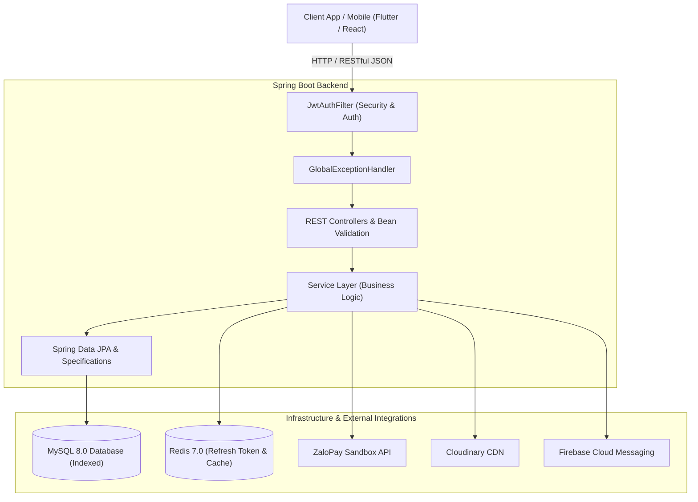

# Hotel Booking Backend API (Enterprise Grade)

[](https://openjdk.org/)
[](https://spring.io/projects/spring-boot)
[](https://spring.io/projects/spring-security)
[](https://www.mysql.com/)
[](https://redis.io/)
[](http://localhost:8080/api/swagger-ui.html)
[](https://www.docker.com/)
[-success.svg)](https://github.com/NHTK412/hotel-booking-be)

> Hệ thống Backend RESTful API hoàn chỉnh phục vụ nền tảng đặt phòng khách sạn (Hotel Booking Platform), được xây dựng theo kiến trúc phân tầng chuẩn doanh nghiệp (Layered Architecture), chú trọng tối ưu hiệu năng cao, xử lý tranh chấp đồng thời (Concurrency Control), bảo mật đa tầng và sẵn sàng đóng gói Container (Dockerized).

---

## Bảng Mục Lục (Table of Contents)
- [Điểm Nổi Bật & Tính Năng Chính](#điểm-nổi-bật--tính-năng-chính)
- [Kiến Trúc Hệ Thống & Kỹ Thuật Chuyên Sâu](#kiến-trúc-hệ-thống--kỹ-thuật-chuyên-sâu)
- [Công Nghệ Sử Dụng (Tech Stack)](#công-nghệ-sử-dụng-tech-stack)
- [Cấu Trúc Thư Mục Dự Án](#cấu-trúc-thư-mục-dự-án)
- [Hướng Dẫn Cài Đặt & Chạy Ứng Dụng](#hướng-dẫn-cài-đặt--chạy-ứng-dụng)
  - [Cách 1: Chạy Siêu Tốc Với Docker Compose (Khuyến nghị)](#cách-1-chạy-siêu-tốc-với-docker-compose-khuyến-nghị)
  - [Cách 2: Chạy Thủ Công Trên Local (Maven + Java 21)](#cách-2-chạy-thủ-công-trên-local-maven--java-21)
- [Kiểm Thử Tự Động (Automated Testing)](#kiểm-thử-tự-động-automated-testing)
- [Tài Liệu API & Swagger UI](#tài-liệu-api--swagger-ui)
- [Bảo Mật & Quản Lý Biến Môi Trường](#bảo-mật--quản-lý-biến-môi-trường)
- [Tác Giả & Liên Hệ (Author)](#tác-giả--liên-hệ-author)

---

## Điểm Nổi Bật & Tính Năng Chính

### 1. Phân Hệ Người Dùng & Xác Thực (Authentication & Authorization)
- **Đăng ký & Đăng nhập**: Xác thực tài khoản chuẩn mật khẩu BCrypt, hỗ trợ kích hoạt tài khoản qua OTP Email.
- **Social Login (OAuth2)**: Hỗ trợ đăng nhập nhanh bằng Google & Facebook OAuth với cơ chế định danh `provider_id` (`sub`) an toàn.
- **Token Rotation & Redis Session**: Cơ chế cấp phát cặp **Access Token (15 phút)** và **Refresh Token (7 ngày)** lưu trữ và kiểm soát thu hồi tức thời trên Redis.
- **Phân quyền người dùng (RBAC)**: Phân quyền đa cấp bậc `ROLE_USER`, `ROLE_HOST`, `ROLE_ADMIN` được kiểm soát chặt chẽ qua Method Security (`@PreAuthorize`).

### 2. Quản Lý Khách Sạn & Đặt Phòng (Booking Engine)
- **Tra cứu & Tìm kiếm linh hoạt**: Tìm kiếm phòng theo địa điểm, khoảng giá, sức chứa, tiện nghi và kiểm tra phòng trống theo khoảng thời gian thực tế (`checkInDate` -> `checkOutDate`).
- **Xử lý tranh chấp đặt phòng (Anti-Overbooking)**: Áp dụng cơ chế **Optimistic Locking** (`@Version` + `LockModeType.OPTIMISTIC_FORCE_INCREMENT`) ngăn chặn triệt để tình trạng Race Condition khi nhiều người dùng cùng đặt một phòng tại cùng một thời điểm.
- **Quản lý đơn đặt phòng**: Quản lý vòng đời đơn (`PENDING` -> `CONFIRMED` -> `COMPLETED` -> `CANCELLED`). Khách hàng có thể tra cứu lịch sử, hủy đơn trong hạn định; Host quản lý duyệt và check-in.

### 3. Tích Hợp Cổng Thanh Toán ZaloPay
- Tạo đơn thanh toán trực tuyến qua cổng **ZaloPay Sandbox API** với HMAC-SHA256 signature xác thực chữ ký số an toàn.
- Xử lý Callback Webhook tự động cập nhật trạng thái đơn đặt phòng và hỗ trợ truy vấn trạng thái thanh toán theo thời gian thực.

### 4. Đánh Giá & Thống Kê Báo Cáo Doanh Thu
- **Hệ thống Reviews**: Khách hàng đánh giá chất lượng (1 - 5 sao) và nhận xét; hệ thống tự động cập nhật điểm trung bình của khách sạn.
- **Báo cáo doanh thu thời gian thực**: Sử dụng **Database Aggregate Queries** (`SUM`, `COUNT`, `GROUP BY`) trực tiếp trên CSDL thay vì In-memory processing, tăng tốc độ xử lý gấp nhiều lần khi dữ liệu lớn.

---

## Kiến Trúc Hệ Thống & Kỹ Thuật Chuyên Sâu



### Các Giải Pháp Kỹ Thuật Tối Ưu Nổi Bật (Portfolio Showcase)

1. **Kiểm Soát Tranh Chấp & Chống Overbooking (Optimistic Locking)**:
   - Triển khai `@Version` và `LockModeType.OPTIMISTIC_FORCE_INCREMENT` trên entity `Room`.
   - Ngăn chặn triệt để Race Condition khi nhiều người cùng đặt 1 phòng đồng thời mà không gây nghẽn connection pool (Pessimistic Lock). Đã kiểm chứng qua test đa luồng.

2. **Tối Ưu Truy Vấn Lọc Phòng Trống & Thống Kê (Composite Index & DB Aggregation)**:
   - **Composite Index**: Đánh chỉ mục `idx_booking_dates_status` chuyển truy vấn lọc phòng giao thoa thời gian từ Full-table Scan sang Index Range Scan $O(\log N)$.
   - **DB Aggregation**: Chuyển toàn bộ phép tính doanh thu/đánh giá xuống CSDL bằng JPQL (`SUM`, `COUNT`, `AVG`, `GROUP BY`) thay vì xử lý in-memory Java Stream, giảm tải 90% bộ nhớ heap $O(N)$.

3. **Xử Lý Thanh Toán Bằng ZaloPay (HMAC-SHA256 & Idempotent Callback)**:
   - Xác thực chữ ký số HMAC-SHA256 chống giả mạo dữ liệu giữa Client - Gateway - Server.
   - Xử lý Webhook Callback đảm bảo tính **Idempotency** (kiểm tra trạng thái đơn trước khi cập nhật), chống ghi nhận trùng lặp khi Gateway retry nhiều lần.

4. **Đóng Gói Container & Cấu Hình JVM Container-Aware**:
   - **Multi-stage Build**: Giảm dung lượng Docker Image xuống < 180MB (`eclipse-temurin:21-jre-alpine`).
   - **JVM Container Tuning**: Cấu hình `-XX:+UseContainerSupport -XX:MaxRAMPercentage=75.0` tránh lỗi OOMKilled do nhận diện sai RAM máy host; chạy dưới quyền non-root user `spring:spring`.

---

## Công Nghệ Sử Dụng (Tech Stack)

| Hạng Mục | Công Nghệ & Thư Viện | Mô Tả |
| :--- | :--- | :--- |
| **Core Platform** | Java 21 (LTS), Spring Boot 3.5.x | Nền tảng ứng dụng hiện đại, hiệu năng cao |
| **Bảo Mật** | Spring Security 6, JJWT 0.11.5 | Stateless JWT Authentication, BCrypt Hashing |
| **Cơ Sở Dữ Liệu** | MySQL 8.0, Hibernate 6, Spring Data JPA | Quản lý dữ liệu quan hệ, JPA Specifications |
| **Bộ Nhớ Đệm** | Redis 7 Alpine, Spring Data Redis | Lưu trữ Refresh Token có TTL, Cache dữ liệu |
| **Cổng Thanh Toán** | ZaloPay Sandbox Gateway API | Tích hợp cổng thanh toán trực tuyến |
| **Lưu Trữ & Thông Báo** | Cloudinary CDN, Firebase Admin SDK | Upload hình ảnh đám mây, Push Notification |
| **Tài Liệu API** | Springdoc OpenAPI 3.0 / Swagger UI | Tài liệu API tương tác, tích hợp JWT Header |
| **Kiểm Thử** | JUnit 5, Mockito, Spring Test (MockMvc) | Bộ kiểm thử tự động Unit & Integration Tests |
| **DevOps & Deploy** | Docker, Docker Compose, Alpine Linux | Đóng gói Multi-stage build và điều phối container |

---

## Cấu Trúc Thư Mục Dự Án

```
hotel-booking-be/
├── .env.example                               # Mẫu cấu hình biến môi trường
├── Dockerfile                                 # Multi-stage build Dockerfile (Alpine + Non-root)
├── docker-compose.yml                         # Điều phối MySQL + Redis + Backend
├── pom.xml                                    # Khai báo dependencies Maven
├── tasks/                                     # Tài liệu quản lý dự án (Roadmap & Checklist)
│   ├── CHECKLIST.md                           # Bảng theo dõi tiến độ 15 tasks (100% Complete)
│   └── TASK_DETAILS.md                        # Chi tiết kỹ thuật & Tiêu chí nghiệm thu từng task
└── src/
    ├── main/
    │   ├── java/com/example/hotelbooking/
    │   │   ├── config/                        # Cấu hình hệ thống (Security, Redis, OpenAPI, ZaloPay)
    │   │   ├── controller/                    # REST Controllers tiếp nhận request HTTP
    │   │   ├── dto/                           # Data Transfer Objects kèm Bean Validation
    │   │   ├── exception/                     # Custom Exceptions & GlobalExceptionHandler
    │   │   ├── model/                         # JPA Entities (Optimistic Lock @Version, Indexes)
    │   │   ├── repository/                    # Spring Data JPA Repositories & Aggregate Queries
    │   │   ├── security/                      # Filter JWT, Token Provider, UserDetails
    │   │   └── service/                       # Business Logic Layer (Auth, Booking, Payment)
    │   └── resources/
    │       ├── application.properties         # Cấu hình mặc định môi trường Development
    │       ├── application-prod.properties    # Cấu hình môi trường Production (Docker)
    │       └── application.properties.example # File mẫu properties
    └── test/                                  # Bộ kiểm thử tự động (57 Tests)
        └── java/com/example/hotelbooking/
            ├── config/                        # Unit test cấu hình Properties
            ├── controller/                    # Integration test tầng Web (MockMvc)
            ├── service/                       # Unit test tầng Nghiệp vụ & Concurrency test
            └── validation/                    # Unit test ràng buộc Bean Validation DTOs
```

---

## Hướng Dẫn Cài Đặt & Chạy Ứng Dụng

### Yêu Cầu Tiên Quyết (Prerequisites)
- Đã cài đặt **Git**
- Đã cài đặt **Docker & Docker Compose** (hoặc **Java 21 + MySQL + Redis** nếu chạy local)

---

### Cách 1: Chạy Siêu Tốc Với Docker Compose (Khuyến nghị)

Chỉ với 1 câu lệnh duy nhất, toàn bộ hệ thống gồm **MySQL 8.0**, **Redis 7** và **Spring Boot Backend** sẽ tự động được build và khởi động:

```bash
# 1. Clone repository
git clone https://github.com/NHTK412/hotel-booking-be.git
cd hotel-booking-be

# 2. Tạo file .env từ mẫu (có thể tùy chỉnh nếu muốn)
cp .env.example .env

# 3. Khởi động toàn bộ container
docker compose up -d --build
```

- **Backend API**: `http://localhost:8080/api`
- **Swagger UI**: `http://localhost:8080/api/swagger-ui.html`
- **MySQL Database**: `localhost:3308`
- **Redis Cache**: `localhost:6379`

> Dừng hệ thống:
```bash
docker compose down
```

---

### Cách 2: Chạy Thủ Công Trên Local (Maven + Java 21)

#### 1. Chuẩn bị môi trường CSDL:
- Đảm bảo **MySQL** đang chạy tại port `3306` (Database: `hotelbooking`).
- Đảm bảo **Redis** đang chạy tại port `6379`.

#### 2. Cấu hình properties:
Sao chép `application.properties.example` thành `application.properties`:
```bash
cp src/main/resources/application.properties.example src/main/resources/application.properties
```

#### 3. Chạy ứng dụng qua Maven Wrapper:
```bash
# Windows
.\mvnw.cmd spring-boot:run

# Linux / MacOS
./mvnw spring-boot:run
```

---

## Kiểm Thử Tự Động (Automated Testing)

Dự án sở hữu bộ kiểm thử tự động toàn diện với **57 test cases** bao phủ toàn bộ các tầng:

- **Unit Tests**: Kiểm thử nghiệp vụ Đăng ký, Đăng nhập, OAuth2, Refresh Token Rotation, Gửi OTP, Tính tiền phòng & chiết khấu, Kiểm tra phòng trống, Phân quyền truy cập.
- **Concurrency Test**: Giả lập 10 luồng đặt phòng đồng thời kiểm tra tính an toàn của Optimistic Lock.
- **DTO Validation Tests**: Kiểm tra toàn diện 19 kịch bản validation đầu vào.
- **Integration Tests**: Kiểm thử luồng HTTP Request -> Security Filter -> Controller -> GlobalExceptionHandler qua `MockMvc`.

Chạy toàn bộ bộ test bằng lệnh:
```bash
# Windows
.\mvnw.cmd test

# Linux / MacOS
./mvnw test
```

**Kết quả kiểm thử:**
```
[INFO] Results:
[INFO] Tests run: 57, Failures: 0, Errors: 0, Skipped: 0
[INFO] ------------------------------------------------------------------------
[INFO] BUILD SUCCESS
[INFO] ------------------------------------------------------------------------
```

---

## Tài Liệu API & Swagger UI

Tài liệu API tương tác trực quan chuẩn **OpenAPI 3.0** được tích hợp sẵn:

**URL Truy Cập**: [http://localhost:8080/api/swagger-ui.html](http://localhost:8080/api/swagger-ui.html)

### Các Tính Năng Nổi Bật Trên Swagger UI:
- **Authorize Bearer JWT**: Nút **Authorize** cho phép nhập Access Token để test trực tiếp các API yêu cầu đăng nhập.
- **Phân nhóm API trực quan**: Phân chia rõ ràng các nhóm:
  - `Authentication Controller`: Đăng ký, Đăng nhập, Refresh Token, Đăng xuất, OAuth2.
  - `Accommodation Controller`: Quản lý danh sách khách sạn, tìm kiếm theo vị trí/tiện nghi.
  - `Room Type & Room Controller`: Quản lý loại phòng, giá, tình trạng phòng.
  - `Booking Controller`: Tạo đơn đặt phòng, tra cứu lịch sử, hủy đơn, kiểm tra phòng trống.
  - `ZaloPay & Payment Controller`: Tạo URL thanh toán ZaloPay, xử lý Webhook Callback.
  - `Review Controller`: Đánh giá và nhận xét khách sạn.
  - `User Controller`: Quản lý hồ sơ cá nhân và phân quyền Host.

---

## Bảo Mật & Quản Lý Biến Môi Trường

Dự án tuân thủ nghiêm ngặt nguyên tắc **12-Factor App**:
- Không lưu trữ mật khẩu thuần (sử dụng chuẩn mã hóa **BCrypt** với salt ngẫu nhiên).
- Không hardcode các thông tin nhạy cảm (Secret Key, API Key, Database Password) trong source code.
- Tất cả các biến nhạy cảm được cấu hình thông qua file `.env` hoặc biến môi trường hệ điều hành:

| Biến Môi Trường | Ý Nghĩa | Giá Trị Mặc Định Mẫu |
| :--- | :--- | :--- |
| `SPRING_PROFILES_ACTIVE` | Profile Spring Boot đang chạy | `prod` / `dev` |
| `SPRING_DATASOURCE_URL` | JDBC URL kết nối MySQL | `jdbc:mysql://mysql:3306/hotelbooking?...` |
| `MYSQL_ROOT_PASSWORD` | Mật khẩu root của MySQL | `root123` |
| `REDIS_HOST` | Hostname của dịch vụ Redis | `redis` / `localhost` |
| `JWT_SECRET_KEY` | Khóa bí mật HMAC-SHA256 (256-bit) | Khóa base64 256-bit |
| `ZALOPAY_APP_ID` | App ID cổng thanh toán ZaloPay | `2553` (Sandbox) |
| `ZALOPAY_KEY1` | Key 1 tạo MAC checksum đơn hàng | Key Sandbox |
| `MAIL_USERNAME` | Email gửi OTP xác thực tài khoản | `your_email@gmail.com` |

---

## Tác Giả & Liên Hệ (Author)

- **Họ và tên**: Nguyễn Hữu Tuấn Khang
- **GitHub**: [@NHTK412](https://github.com/NHTK412)
- **Dự án**: [Hotel Booking Backend API](https://github.com/NHTK412/hotel-booking-be)

